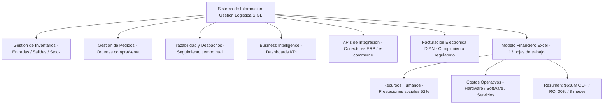

<div align="center">

# 📦 Sistema de Información para Gestión Logística en Empresa de Distribución de Productos Electrónicos


</div>

---

---

## 📋 Descripción General

Este proyecto corresponde al **Laboratorio No. 1** de la asignatura **Integración de Sistemas**, enfocado en la aplicación de principios de **Contabilidad Analítica y Planificación Financiera de Proyectos TI** en un escenario real del sector empresarial colombiano.

Se desarrolla la estimación de costos, planificación de recursos y análisis de rentabilidad para un **Sistema de Información orientado a la Gestión Logística** de una empresa de distribución de productos electrónicos. El modelo financiero construido abarca desde los salarios del equipo de desarrollo hasta los impuestos, costos operativos, contingencias y precio de venta al cliente, generando una visión integral y realista del presupuesto de un proyecto de software en Colombia.

El trabajo evidencia cómo el costo real de un proyecto tecnológico supera ampliamente el simple costo salarial, incorporando cargas prestacionales del 52%, IVA del 19% sobre compras tecnológicas, servicios públicos, licencias, fondos de imprevistos y márgenes de rentabilidad competitivos en el mercado TI colombiano.

---

## 🎓 Información Académica

| Campo | Detalle |
|---|---|
| **Estudiante** | Ing. Alejandro De Mendoza |
| **Profesor** | Ing. Edwin Eduardo Millan Rojas |
| **Asignatura** | Integración de Sistemas |
| **Actividad** | Laboratorio No. 1 – Contabilidad Analítica y Planificación de Proyectos TI |
| **Institución** | Fundación Universitaria Internacional de La Rioja (UNIR) |
| **Sede** | Bogotá D.C., Colombia |
| **Fecha** | Mayo 2026 |
| **Versión** | 1.0 |

---

## 📚 Tabla de Contenido

1. [Descripción del Sistema de Información](#-descripción-del-sistema-de-información-presupuestado)
2. [Estructura del Modelo Financiero Excel](#-estructura-del-modelo-financiero-excel)
3. [Resumen de Valores Financieros](#-resumen-de-valores-financieros-clave)
4. [Equipo del Proyecto](#-equipo-del-proyecto)
5. [Actividades del Proyecto](#-actividades-del-proyecto-18-actividades)
6. [Centros de Costo](#-centros-de-costo-identificados)
7. [Clasificación Analítica de Costos](#-clasificación-analítica-de-costos)
8. [Tecnologías y Herramientas](#-tecnologías-y-herramientas-utilizadas)
9. [Instrucciones para Navegar el Excel](#-instrucciones-para-abrir-y-navegar-el-archivo-excel)
10. [Conclusiones Principales](#-conclusiones-principales)
11. [Recomendaciones Estratégicas](#-recomendaciones-estratégicas)
12. [Licencia](#-licencia-académica)

---

## 🖥️ Descripción del Sistema de Información Presupuestado

### Nombre del Proyecto
**Sistema de Información para Gestión Logística – Empresa de Distribución de Productos Electrónicos**

### Problema Empresarial que Resuelve
Las empresas de distribución de productos electrónicos enfrentan desafíos críticos en la gestión de inventarios, trazabilidad de pedidos, coordinación de despachos y generación de reportes gerenciales. La ausencia de un sistema centralizado genera duplicidad de información, errores operativos, pérdidas económicas y falta de visibilidad sobre el flujo logístico.

### Módulos Funcionales del Sistema

| Módulo | Descripción |
|---|---|
| **Gestión de Inventarios** | Control en tiempo real de entradas, salidas y existencias de productos electrónicos |
| **Gestión de Pedidos** | Registro, seguimiento y confirmación de órdenes de compra y venta |
| **Trazabilidad y Despachos** | Rastreo de productos desde recepción hasta entrega al cliente final |
| **Reportes y Business Intelligence (BI)** | Dashboards gerenciales y reportes analíticos de operaciones |
| **APIs e Integraciones** | Conectores con sistemas externos, plataformas de e-commerce y transportistas |
| **Integración con ERP Existente** | Sincronización con el sistema ERP de la empresa para datos financieros y contables |

### Alcance
- **Duración:** 8 meses de desarrollo e implementación
- **Metodología recomendada:** Scrum (sprints de 2 semanas) / Kanban
- **País de ejecución:** Colombia – Bogotá D.C.
- **Moneda:** Pesos Colombianos (COP)

---

## 📊 Estructura del Modelo Financiero Excel

El archivo `Laboratorio_Contabilidad_Analitica_TI_Alejandro_De_Mendoza.xlsx` contiene **13 hojas de trabajo** organizadas de forma modular:

| # | Hoja | Propósito |
|---|---|---|
| 1 | **PORTADA** | Carátula del laboratorio, índice de contenido del libro e información del proyecto |
| 2 | **SUPUESTOS** | Parámetros y variables base del modelo: duración, horas laborables (173 hrs/mes), margen de ganancia (30%), fondo de imprevistos (10%), IVA (19%) y carga prestacional (52%) |
| 3 | **REC_HUMANO** | Equipo de trabajo completo con salarios mensuales, meses de participación, subtotales de salario base y cálculo de prestaciones sociales al 52% |
| 4 | **ACTIVIDADES** | Tabla principal de contabilidad analítica: 18 actividades con recurso humano asignado, horas, costo por hora y subtotales de costo RH y técnico |
| 5 | **REC_TECNICO** | Hardware (portátiles, servidor, UPS, monitores, almacenamiento) y Software/Licencias (IDE, hosting cloud, dominio, BD, Jira, GitHub, Office 365, CI/CD) |
| 6 | **IMPUESTOS** | Cálculo del IVA del 19% sobre compras tecnológicas (hardware y software con costo). Nota sobre estampillas regionales y retención en la fuente |
| 7 | **COSTOS_OPERATIVOS** | Servicios públicos (energía eléctrica, internet fibra, agua, telefonía) y otros costos operativos (papelería, transporte, capacitación, arriendo, seguridad informática) durante 8 meses |
| 8 | **IMPREVISTOS** | Fondo de contingencias del 10% sobre costo total operativo. Incluye identificación de 7 causas de imprevistos en proyectos TI colombianos |
| 9 | **RESUMEN_COSTOS** | Consolidado total por categorías de costo, cálculo de inversión total, margen de ganancia y precio final de venta al cliente |
| 10 | **RENTABILIDAD** | Indicadores financieros: margen de utilidad (23.1%), ROI (30%), costo mensual promedio, ingreso mensual promedio, punto de equilibrio y participación del RH en el costo total |
| 11 | **CLASIFICACION** | Clasificación analítica por: costos directos vs. indirectos, costos fijos vs. variables y centros de costo (CC-001 a CC-005) |
| 12 | **GANTT** | Diagrama de Gantt con las 18 actividades distribuidas en los 8 meses del proyecto, responsables asignados y fases de ejecución |
| 13 | **RESUMEN_EJECUTIVO** | Dashboard ejecutivo con KPIs clave del proyecto, conclusiones del análisis y recomendaciones estratégicas |

---

## 💰 Resumen de Valores Financieros Clave

| Indicador | Valor (COP) |
|---|---|
| **Inversión Total del Proyecto** | $491.029.220 |
| **Precio Final de Venta** | $638.337.986 |
| **Ganancia Esperada (30%)** | $147.308.766 |
| **Margen de Utilidad sobre Ventas** | **23.1%** |
| **ROI (Retorno sobre Inversión)** | **30%** |
| **Duración del Proyecto** | **8 meses** |
| **Total Personas en el Equipo** | **11 personas** |

### Desglose de Categorías de Costo

| Categoría | Descripción |
|---|---|
| 1. Mano de Obra | Salarios + Prestaciones Sociales (52%) — mayor componente del costo |
| 2. Hardware | Portátiles de desarrollo, servidor de pruebas, UPS, monitores, almacenamiento |
| 3. Software y Licencias | IDE, hosting cloud, dominio SSL, BD empresarial, Jira, GitHub, Office 365, CI/CD |
| 4. IVA Tecnológico (19%) | Impuesto sobre hardware y software con costo — Estatuto Tributario Colombia |
| 5. Servicios Públicos | Energía eléctrica, internet fibra óptica, agua, telefonía móvil |
| 6. Otros Costos Operativos | Papelería, transporte, capacitación, arriendo, comunicaciones |
| 7. Fondo de Imprevistos (10%) | Contingencias por retrasos, cambios de requerimientos, fallos técnicos |

### Fórmulas del Modelo Financiero

```
Costo Total = Costos Directos + Costos Indirectos + Imprevistos
Precio de Venta = Costo Total + Margen de Ganancia (30%)
ROI = (Ganancia / Inversión Total) × 100
Costo Hora RH = Salario Mensual / 173 horas/mes
Prestaciones = Salario Base × 52% (carga prestacional Colombia)
IVA = Base Gravable × 19% (compras tecnológicas)
```

---

## 👥 Equipo del Proyecto

| # | Cargo / Perfil | Cantidad | Rol en el Proyecto |
|---|---|:---:|---|
| 1 | **Director de Proyecto** | 1 | Control integral, gestión del alcance, tiempo y presupuesto |
| 2 | **Analista de Requerimientos** | 1 | Levantamiento y especificación de necesidades del cliente |
| 3 | **Arquitecto de Software** | 1 | Diseño de la arquitectura técnica del sistema |
| 4 | **Desarrollador Backend Senior** | **2** | Desarrollo del servidor, APIs y lógica de negocio |
| 5 | **Desarrollador Frontend** | 1 | Interfaz de usuario, módulos de reportes y dashboards BI |
| 6 | **Diseñador UX/UI** | 1 | Experiencia de usuario e interfaces gráficas |
| 7 | **Ingeniero QA / Pruebas** | 1 | Validación funcional, pruebas de carga y corrección |
| 8 | **Administrador de Base de Datos** | 1 | Diseño, implementación y mantenimiento de la BD logística |
| 9 | **Especialista en Integración TI** | 1 | APIs, conectores con ERP y sistemas de terceros |
| 10 | **Soporte e Implementación** | 1 | Implantación en producción y capacitación de usuarios |
| | **TOTAL** | **11** | |

> **Nota:** La carga prestacional del **52%** aplicada en Colombia incluye: Salud (8.5%), Pensión (12%), ARL promedio, Caja de Compensación (4%), Cesantías (8.33%), Intereses sobre cesantías (1%), Prima de servicios (8.33%), Vacaciones (4.17%), SENA (2%) e ICBF (3%). Bases legales: Ley 100/1993, Ley 21/1982, CST Art. 249, CST Art. 306, CST Art. 186.

---

## 📋 Actividades del Proyecto (18 Actividades)

| Código | Actividad | Responsable Principal |
|---|---|---|
| ACT001 | Levantamiento y análisis de requerimientos | Analista de Requerimientos |
| ACT002 | Diseño arquitectura del sistema | Arquitecto de Software |
| ACT003 | Diseño de base de datos logística | Administrador de BD |
| ACT004 | Diseño de interfaz de usuario (UX/UI) | Diseñador UX |
| ACT005 | Desarrollo módulo gestión de inventarios | Desarrollador Backend |
| ACT006 | Desarrollo módulo gestión de pedidos | Desarrollador Backend |
| ACT007 | Desarrollo módulo trazabilidad y despachos | Desarrollador Backend |
| ACT008 | Desarrollo módulo reportes y BI básico | Desarrollador Frontend |
| ACT009 | Desarrollo de APIs e integraciones | Especialista en Integración TI |
| ACT010 | Integración con ERP existente de la empresa | Especialista en Integración TI |
| ACT011 | Pruebas funcionales y de carga | Ingeniero QA |
| ACT012 | Corrección de errores y ajustes | Ingeniero QA |
| ACT013 | Configuración de servidores e infraestructura | Soporte |
| ACT014 | Implantación del sistema en producción | Soporte |
| ACT015 | Capacitación de usuarios finales | Director de Proyecto |
| ACT016 | Documentación técnica y manual de usuario | Director de Proyecto |
| ACT017 | Gestión del proyecto y control de avance | Director de Proyecto |
| ACT018 | Evaluación final y cierre del proyecto | Director de Proyecto |

---

## 🏢 Centros de Costo Identificados

| Código | Centro de Costo | Descripción |
|---|---|---|
| **CC-001** | Gestión del Proyecto | Director de Proyecto – control integral |
| **CC-002** | Ingeniería y Desarrollo | Equipo técnico – backend, frontend, DBA |
| **CC-003** | Calidad y Pruebas | Ingeniero QA – validación y corrección |
| **CC-004** | Infraestructura Tecnológica | Servidores, cloud, redes, seguridad |
| **CC-005** | Implantación y Capacitación | Soporte, formación de usuarios |

---

## 📈 Clasificación Analítica de Costos

### Costos Directos
- Salarios del equipo de desarrollo
- Prestaciones sociales
- Equipos de cómputo (hardware)
- Licencias de herramientas de desarrollo
- Hosting y base de datos del proyecto

### Costos Indirectos
- Energía eléctrica
- Internet empresarial
- Administración y papelería
- Transporte y viáticos
- Capacitación del equipo
- Servicios públicos generales

### Costos Fijos
- Salarios mensuales fijos
- Internet (contrato fijo)
- Hosting cloud (contrato mensual)
- Licencias anuales / mensuales
- Arriendo espacio de trabajo

### Costos Variables
- Transporte y reuniones
- Viáticos por desplazamiento
- Soporte adicional no planificado
- Cambios de requerimientos
- Recursos adicionales por urgencias

---

## 🛠️ Tecnologías y Herramientas Utilizadas

### En el Análisis Financiero
| Herramienta | Uso |
|---|---|
| **Microsoft Excel** | Modelo financiero completo con 13 hojas interconectadas |
| **Microsoft Word** | Informe académico con análisis detallado hoja por hoja |
| **Contabilidad Analítica** | Marco metodológico para identificación y clasificación de costos |

### Tecnologías del Sistema a Desarrollar
| Categoría | Herramientas |
|---|---|
| **IDE de Desarrollo** | JetBrains (IntelliJ IDEA / WebStorm) |
| **Base de Datos** | PostgreSQL |
| **Gestión de Proyectos** | Jira |
| **Control de Versiones** | GitHub Team |
| **Productividad** | Microsoft Office 365 |
| **CI/CD** | GitLab CI |
| **Infraestructura** | Hosting Cloud VPS (2 servidores), Ubuntu Server |
| **Seguridad** | Antivirus corporativo, certificado SSL |
| **S.O. Servidores** | Ubuntu Server (licencia libre) |

### Normativa Legal Aplicada
- **IVA 19%:** Estatuto Tributario Colombia
- **Prestaciones Sociales:** Ley 100/1993, Ley 21/1982, Decreto 1772/1994
- **Cesantías:** CST Art. 249, Ley 52/1975
- **Prima de Servicios:** CST Art. 306
- **Vacaciones:** CST Art. 186
- **SENA:** Ley 119/1994
- **ICBF:** Decreto 118/1957

---

## 📂 Archivos del Proyecto

```
Laboratorio No. 1/
├── Laboratorio_Contabilidad_Analitica_TI_Alejandro_De_Mendoza.xlsx   # Modelo financiero Excel (13 hojas)
├── Desarrollo Proyecto Alejandro De Mendoza.docx                     # Informe académico completo
├── Desarrollo Proyecto Alejandro De Mendoza.pdf                      # Informe en formato PDF
├── colgii58t4lab.docx                                                 # Documento de referencia del laboratorio
└── README.md                                                          # Este archivo
```

---

## 📖 Instrucciones para Abrir y Navegar el Archivo Excel

### Apertura
1. Abrir `Laboratorio_Contabilidad_Analitica_TI_Alejandro_De_Mendoza.xlsx` con **Microsoft Excel 2016 o superior** (recomendado) o LibreOffice Calc.
2. Si aparece advertencia de macros o contenido externo, seleccionar **"Habilitar contenido"**.
3. El archivo abrirá automáticamente en la hoja **RESUMEN_EJECUTIVO** (hoja 13), el dashboard ejecutivo del proyecto.

### Navegación Recomendada
Seguir el orden lógico del modelo financiero:

```
PORTADA → SUPUESTOS → REC_HUMANO → ACTIVIDADES → REC_TECNICO
→ IMPUESTOS → COSTOS_OPERATIVOS → IMPREVISTOS → RESUMEN_COSTOS
→ RENTABILIDAD → CLASIFICACION → GANTT → RESUMEN_EJECUTIVO
```

### Hojas Clave para Revisión Rápida
| Si quieres ver... | Ve a la hoja... |
|---|---|
| Resumen general del proyecto | **RESUMEN_EJECUTIVO** |
| Totales de costo y precio de venta | **RESUMEN_COSTOS** |
| Indicadores financieros (ROI, margen) | **RENTABILIDAD** |
| Equipo y salarios | **REC_HUMANO** |
| Cronograma Gantt | **GANTT** |
| Clasificación analítica de costos | **CLASIFICACION** |

### Modificación del Modelo
- Los parámetros ajustables están en la hoja **SUPUESTOS** (margen de ganancia, duración, horas/mes, % imprevistos).
- Modificar un supuesto actualiza automáticamente todas las hojas vinculadas.

---

## ✅ Conclusiones Principales

1. **El proyecto requiere una inversión total de $491.029.220 COP**, cifra que cubre todos los riesgos identificados mediante el fondo de imprevistos del 10%.

2. **El recurso humano representa más del 70% del costo total** — es el mayor factor de costo en proyectos TI, consecuencia directa de la carga prestacional del 52% en Colombia.

3. **La carga prestacional del 52% es un factor crítico** que no puede omitirse en el presupuesto de ningún proyecto de software desarrollado en Colombia.

4. **El IVA del 19% sobre compras tecnológicas** (hardware y software) incrementa significativamente los costos de infraestructura y debe contemplarse desde la fase de estimación.

5. **El fondo de imprevistos del 10% protege el proyecto** ante escenarios de cambio de requerimientos, retrasos técnicos, rotación de personal o fluctuaciones en costos de proveedores.

6. **Con un margen del 30% y un ROI del 30%, el proyecto es financieramente viable** y competitivo dentro del mercado de desarrollo de software colombiano.

7. **La metodología ágil (Scrum/Kanban) reduciría costos** de corrección y cambios de requerimientos al detectar problemas tempranamente en sprints cortos.

8. **El monitoreo mensual de indicadores financieros** es fundamental para detectar desviaciones presupuestales y mantener la viabilidad económica del proyecto.

---

## 🎯 Recomendaciones Estratégicas

- ✅ Implementar control de tiempos con herramienta como **Jira o ClickUp** desde el día 1.
- ✅ Usar **metodología Scrum** (sprints de 2 semanas) para reducir riesgo de cambios tardíos.
- ✅ Monitorear **desviaciones presupuestales mensualmente** con el modelo Excel del laboratorio.
- ✅ Negociar **contratos por prestación de servicios** para optimizar carga tributaria.
- ✅ Automatizar pruebas con **CI/CD (GitLab CI)** para disminuir costos de corrección en fases tardías.
- ✅ **Verificar estampillas regionales** y retenciones ANTES de firmar el contrato con el cliente.
- ✅ **Documentar todos los cambios de requerimientos** con acta firmada para controlar el alcance.

---

## 📜 Licencia Académica

Este proyecto es de carácter **académico** y fue elaborado exclusivamente para la asignatura **Integración de Sistemas** de la **Fundación Universitaria Internacional de La Rioja (UNIR)**.

- El contenido puede ser utilizado con fines educativos citando la fuente.
- No está permitido su uso comercial sin autorización del autor.
- Los valores financieros son estimaciones académicas basadas en el mercado TI colombiano a Mayo 2026.

---

**Elaborado por:** Ing. Alejandro De Mendoza  
**Asignatura:** Integración de Sistemas — UNIR  
**Fecha:** Mayo 2026  
**Versión:** 1.0

---

## Arquitectura



## Autor

**Alejandro De Mendoza**  
Ingeniero Informático · Especialista en IA · Especialista en Ingeniería de Software · Máster en Arquitectura de Software

[](https://github.com/AlejoTechEngineer)
